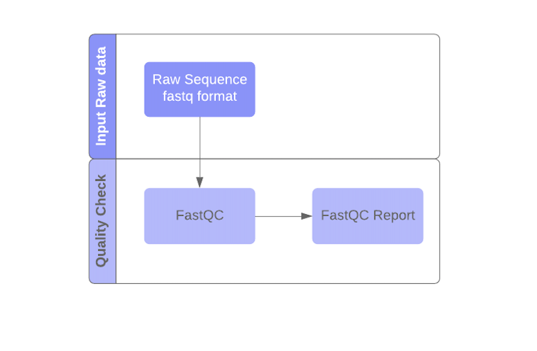

This folder contains details to enable FastQC workflow on private machines using docker. Below are the steps to be followed to host the docker container.

# FastQC-Workflow
Below figure shows the pipeline of the workflow:




FastQC workflow is used to conduct quality control checks on raw NGS data coming from high-throughput sequencing projects, to ensure that the data looks good and there are no problems or biases which may affect its further downstream analysis and use. The input to FastQC is FASTQ file. The output from FastQC, after analyzing a FASTQ file of sequence reads, is a HTML file that may be viewed in a user's browser. The report contains results section for each FastQC module. In addition, graphical and list data are provided by each module, a flag of “Passed”, “Warn” or “Fail” is assigned.

# Docker Container
The docker container is availbale on DockerHub and can be downloaded and initialized by below steps,

```
docker pull apfd6/fastqc_wf  
```

## Configuring the container

### Initialize HTCondor

```
For Windows:
docker run -it -d -p 22:22 apfd6/fastqc_wf:latest bash

For Linux:
docker run -it apfd6/fastqc_wf:latest bash

docker container ls
docker exec --user root -it <ContainerId> bash
service ssh start
cd condor-8.8.9
. ./condor.sh
condor_master
Ctrl +p +q
docker exec --user bamboo -it <ContainerId> bash
cd condor-8.8.9
. ./condor.sh

(move to home folder i.e. /home/bamboo)  
cd ..  

stay logged in as bamboo user
```

### User Credentials:
The workflow requires 2 different user credentials:  a workflow ssh key to access data on the submit host and user’s iPlant password to access the data in iRods.  

#### Workflow SSH Key  
```
$ mkdir -p ~/.ssh  

$ ssh-keygen -t rsa -b 2048 -f ~/.ssh/workflow  
  (just hit enter when asked for a passphrase)  
  
$ cat ~/.ssh/workflow.pub >>~/.ssh/authorized_keys

$ chmod 755 ~/.ssh
$ chmod 644 ~/.ssh/authorized_keys
```

#### iPlant connection file

To access data from the iPlant iRods repository, you need a file in your home directory. The name and format of this file depends on if you are using a system with iRods version 3 or version 4. For version 3, you need a file named ~/irods.iplant.json, with 0600 permission and content as below:
```
{
    "irods_host": "data.iplantcollaborative.org",  
    "irods_port": 1247,  
    "irods_user_name": "YOUR_IRODS_USERNAME",  
    "irods_zone_name": "iplant",  
    "irodspassword": "YOUR_IRODS_PASSWORD"  
}

$ chmod 0600 irods.iplant.json
```
#### Initialize workflow configuration file
Open .fastqc-workflow.conf file (this is a hidden file, it can be seen with "ls -all" command) and make below changes
```
ls -all
vi .fastqc-workflow.conf

[cyverse]
username = <your cyverse user name>
```
#### Workflow output location
Below files are located in /home/bamboo/fastqc/conf/distributes/site.conf folder
```
for generation of output on cyverse account
output_site = irods_iplant

for generation of output on your own docker container
output_site = local
```
### Inputs to workflow
**inputs-fastq.txt**

URLs are given in the **irods:///[path]/[filename]** format. 

For example, to specify file **/iplant/home/cyverse_user_name/readsleft.fq** use:
```
irods:///iplant/home/<username>/readsleft.fq
```
Do not use comments or whitespace in the file. Make sure you have the permission of the data, you could check from the [https://de.cyverse.org/de/](https://de.cyverse.org/de/)

### Outputs of workflow

Workflow generates the fastqc report for each fastq file.

### Initialize Workflow
```
cd fastqc

modify value of output_dir inside the file workflow-generator-multipleOnly to the path in cyverse where output of workflow is expected
example: output_dir= '/iplant/home/<cyverse_username>/Fastqc_wf/Output'

Execute below command:
logs will be generated  showing configuration of executing the workflow.

./workflow-generator --exec-env distributed

pegasus-run  <path of the directory hosting workflow>
  example: pegasus-run  /home/bamboo/fastqc/20200928-135059/wf-20200928-135059
```

### Running and Monitoring the workflow

Note that when Pegasus plans/submits a workflow, a work directory is created and presented in the output. This directory is the handle to the workflow instance and used by Pegasus command line tools. The first tool to use is pegasus-run, which will start the workflow:  

pegasus-run [wfdir]  
Some useful tools to know about:  

pegasus-status -v [wfdir] - Provides status on a currently running workflow.  
pegasus-analyzer [wfdir] - Provides debugging clues why a workflow failed. Run this after a workflow has failed.  
pegasus-statistics [wfdir] - Provides statistics, such as walltimes, on a workflow after it has completed.  
pegasus-remove [wfdir] - Removes a workflow from the system.  

