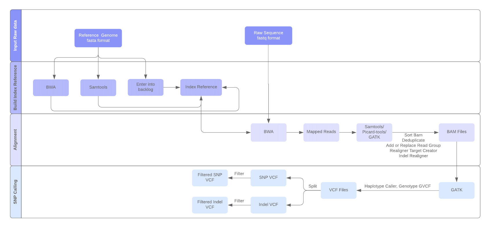

This folder contains details to enable PGen workflow on private machines using docker. Below are the steps to be followed to host the docker container.

# PGen-Workflow
Below figure shows the pipeline of the workflow:




PGen workflow is used to efficiently facilitate large-scale NGS data analysis of genomic variations. The workflow allows users to identify single nucleotide polymorphisms (SNPs) and insertion-deletions (Indels), perform SNP annotation and conduct copy number variation (CNV) analyses on multiple resequencing datasets. PGen workflow is developed using many widely accepted open-source NGS tools for alignment of reads, variants calling, variants filtration, VCF merging and others. The workflow starts by aligning either paired-end or single-end FASTQ reads against the organisms reference genome using BWA. Picard Tools is also used at this step to locate duplicate molecules and assign all reads into groups with the default parameters. After alignment, SNPs and Indels are called using the Haplotype Caller algorithm from Genome Analysis Toolkit (GATK). Filtering criteria are defined in INFO filed in vcf file, where QD stands for quality by depth, FS is Fisher strand values and MQ is mapping quality of variants.  Detected variants were then filtered using criteria QD 	$<$ 26.0 $||$ FS $>$ 60.0 $||$ MQ $<$ 40.0 for SNPs and DQ $<$ 26.0 $||$ FS $>$ 200.0 $||$ MQ $<$ 40.0 for indels. Custom criteria can also be applied by the user. Outputs are generated as BAM and VCF standard formats. In the filtering step, only the SNPs and Indels are considered; however other types of variants can extracted from the generated unfiltered files.

# Docker Container
The docker container is availbale on DockerHub and can be downloaded and initialized by below steps,

```
docker pull apfd6/pgen_wf  
docker run apfd6/pgen_wf  
docker exec --user bamboo -it <ContainerId> bash  

(move to home folder i.e. /home/bamboo)  
cd ..  
```

## Configuring the container

### Initialize HTCondor

```
cd condor-8.8.9
. ./condor.sh
condor_master
```

### User Credentials:
The workflow requires 2 different user credentials:  a workflow ssh key to access data on the submit host and user’s iPlant password to access the data in iRods.  

#### Workflow SSH Key  
```
$ mkdir -p ~/.ssh  

$ ssh-keygen -t rsa -b 2048 -f ~/.ssh/workflow  
  (just hit enter when asked for a passphrase)  
  
$ cat ~/.ssh/workflow.pub >>~/.ssh/authorized_keys
```

#### iPlant connection file

To access data from the iPlant iRods repository, you need a file in your home directory. The name and format of this file depends on if you are using a system with iRods version 3 or version 4. For version 3, you need a file named ~/irods.iplant.json, with 0600 permission and content as below:
```
{
    "irods_host": "data.iplantcollaborative.org",  
    "irods_port": 1247,  
    "irods_user_name": "YOUR_IRODS_USERNAME",  
    "irods_zone_name": "iplant",  
    "irodspassword": "YOUR_IRODS_PASSWORD"  
}

$ chmod 0600 irods.iplant.json
```
#### Initialize workflow configuration file
Open .pgen-workflow.conf file and make below changes
```
[cyverse]
username = <your cyverse user name>
```

### Inputs to workflow

Specifying input data is done in two files inputs-fastq.txt and inputs-ref.txt.

**inputs-fastq.txt**

URLs are given in the irods://[resource]/[path] format. For example, to specify file /iplant/home/shared/digbio/SoyKB/PGen_workflow/SRR1209394.fastq.gz use:

```
irods:///iplant/home/shared/digbio/SoyKB/NGS_workflow/SRR1209394.fastq.gz
```

Do not use comments or whitespace in the file. Make sure you have the permission of the data, you could check from the https://de.iplantcollaborative.org/de/

**inputs-refs.txt**

Reference genome should be in fasta format and it should be a zipped file. For example,
irods://taccCorralRes/iplant/home/shared/digbio/SoyKB/PGen_workflow/Zmays_284_AGPv3.gz

**Single-end or pair-end fastq inputs**

Make sure to specify your input data type (pair or single), and change it in *main.conf* file as below:

```
$ cd ~/PGen-GenomicVariations-Workflow/conf/
$ cat main.conf
# single-end or pair-end
inputs-style = pair-end
```

**chromosomes.txt**

This input file saves the list of chromosomes for alignment and snp calling; user can make their own list according to the reference.

```
zcat reference.fa.gz | grep “>”  > chromosome.txt 
```

## Outputs of workflow:

Workflow generates bam, vcf and mergeGVCF output files. mergeGVCF can be used for future merge if needed. All outputs will be automatically transferred to iPlant data store during the workflow process named after workflow submission date.
For example if we have ‘SRR1209394.fastq.gz’as the input, workflow will generate below files as the outputs.

```
SRR1209394 _addrepl.bai
SRR1209394 _addrepl.bam
SRR1209394 _indel_realigned.bai
SRR1209394_indel_realigned.bam
Submission_date-All.vcf
Submission_date-All.vcf.idx
Submission_date-All_filtered_indel.vcf
Submission_date-All_filtered_indel.vcf.idx
Submission_date-All_filtered_snp.vcf
Submission_date-All_filtered_snp.vcf.idx
Submission_date-mergeGVCF.vcf
Submission_date-mergeGVCF.vcf.idx
```

## SNP Filtration Criteria

Default filtration for snps and indels:

```
snp_filter = QD < 2.0 || FS > 60.0 || MQ < 40.0
indel_filter = QD < 2.0 || FS > 200.0 || MQ < 40
```

Different filtration can be used and changed in ‘main.conf’ file by editing ‘snp_filter’ and ‘indel-filter‘ parameters. (http://gatkforums.broadinstitute.org/discussion/2806/howto-apply-hard-filters-to-a-call-set )

### Initialize Workflow
```
cd rnaseq
./workflow-generator --exec-env distributed
```

### Running and Monitoring the workflow

Note that when Pegasus plans/submits a workflow, a work directory is created and presented in the output. This directory is the handle to the workflow instance and used by Pegasus command line tools. The first tool to use is pegasus-run, which will start the workflow:  

pegasus-run [wfdir]  
Some useful tools to know about:  

pegasus-status -v [wfdir] - Provides status on a currently running workflow.  
pegasus-analyzer [wfdir] - Provides debugging clues why a workflow failed. Run this after a workflow has failed.  
pegasus-statistics [wfdir] - Provides statistics, such as walltimes, on a workflow after it has completed.  
pegasus-remove [wfdir] - Removes a workflow from the system.  

