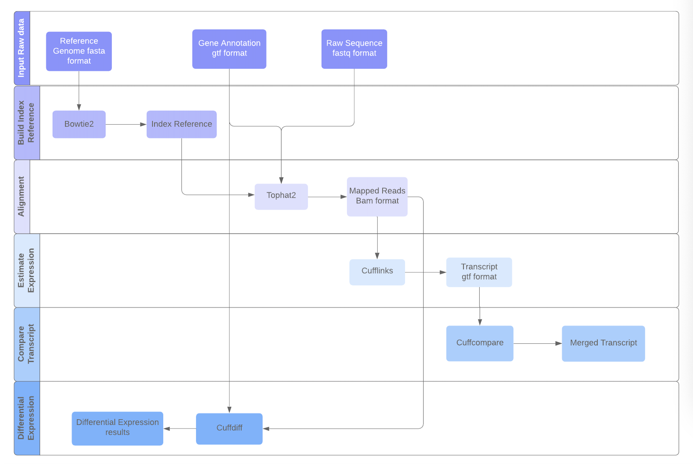

This folder contains details to enable RNASeq workflow on private machines using docker. Below are the steps to be followed to host the docker container.

# RNASeq-Workflow
Below figure shows the pipeline of the workflow:




RNA-Seq analysis workflow is used to perform quantification of gene expression from RNA-Seq transcriptomics data and statistical analysis to discover differential expressed genes/isoform between various experimental groups conditions. The paired-end or single-end reads are aligned to the reference genome via Tophat2. The mapped reads are summarized and aggregated over genes and isoforms for a particular organism’s gene and genome version to then calculate the gene expression FPKMs values via Cufflinks. Then, the transcriptome assembly generated from Cufflinks will be processed via Cuffcompare to perform these comparisons and assess the quality of assembly. Finally, genes and isoforms expressed differentially between the various pair wise comparisons within experimental groups/conditions are identified using Cuffdiff.

# Docker Container
The docker container is availbale on DockerHub and can be downloaded and initialized by below steps,

```
docker pull apfd6/rnaseq_wf:V4  

```

## Configuring the container

### Initialize HTCondor
The commands below were used to initialize condor.
```
docker run -it -d -p 22:22 apfd6/rnaseq_wf:V4 bash
docker container ls
docker exec --user root -it <ContainerId> bash
service ssh start
cd condor-8.8.9
. ./condor.sh
condor_master
Ctrl +p +q
docker exec --user bamboo -it <ContainerId> bash
cd condor-8.8.9
. ./condor.sh

(move to home folder i.e. /home/bamboo)  
cd ..  

stay logged in as bamboo user

```

### User Credentials:
The workflow requires 2 different user credentials:  a workflow ssh key to access data on the submit host and user’s iPlant password to access the data in iRods.  

#### Workflow SSH Key  
```
$ mkdir -p ~/.ssh  

$ ssh-keygen -t rsa -b 2048 -f ~/.ssh/workflow  
  (just hit enter when asked for a passphrase)  
  
$ cat ~/.ssh/workflow.pub >>~/.ssh/authorized_keys

$ chmod 755 ~/.ssh
$ chmod 644 ~/.ssh/authorized_keys

```

#### iPlant connection file

To access data from the iPlant iRods repository, you need a file in your home directory. The name and format of this file depends on if you are using a system with iRods version 3 or version 4. For version 3, you need a file named ~/irods.iplant.json, with 0600 permission and content as below:
```
{
    "irods_host": "data.iplantcollaborative.org",  
    "irods_port": 1247,  
    "irods_user_name": "YOUR_IRODS_USERNAME",  
    "irods_zone_name": "iplant",  
    "irodspassword": "YOUR_IRODS_PASSWORD"  
}

$ chmod 0600 irods.iplant.json
```
#### Initialize workflow configuration file
Open .rnaseq-workflow.conf file and make below changes
```
[cyverse]
username = <your cyverse user name>
```

### Inputs to workflow
**inputs-fastq.txt**

URLs are given in the **irods:///[path]/[filename]** format. 

For example, to specify file **/iplant/home//username//readsleft.fq use:
```
irods:///iplant/home/<username>/readsleft.fq
```
Do not use comments or whitespace in the file. Make sure you have the permission of the data, you could check from the [https://de.cyverse.org/de/](https://de.cyverse.org/de/)

**inputs-ref.txt**

Reference genome should be in fasta format. For example, 
```
irods:///iplant/home/<username>/Gmax_275_v2.0.ch1.fa
```
**inputs-gtf.txt**

Reference genome should be in fasta format. For example, 
```
irods:///iplant/home/<username>/Gmax_275_Wm82.a2.v1.gene.gtf
```
**main.conf**

Specify your input data type (paired or single) and output folder in main.conf as below
```
#single-end or paired-end
inputs-style = paired-end
output_dir = /iplant/home/<username>/output
```

Samples should be list as format sample_# with it fastq files counts, for example, if you have four samples and each of the sample has 4, 6, 8, 2 fastq files. It shoulbe be edit in the main.conf as below:
```
#the replica name of each sample
sample_0 = 4
sample_1 = 6
sample_2 = 8
sample_3 = 2
```
The order of the samples should be consist with it's order in the **inputs-fastq.txt** file. 

Specify the comparison of samples to calculate the differential expression, for example, if you want to compare sample_0 with sample_1, sample_1 with sample_2 and sample_0 with sample_3:
```
#choose the samples which need to be compared
sample_compare_1 = sample__0 & sample__1
sample_compare_2 = sample__1 & sample__2
sample_compare_3 = sample__0 & sample__3
mode = cuffdiff_only
```

### Outputs of workflow
Workflow generates 
- index reference genome **ref.tar**
- binary alignment map (BAM) files **tophat_c0_r0.tar**
- cufflinks results - FPKM **cufflinks_c0_r0.tar**
- cuffcompare results - transcript file **cuffcompare_s0_s1.combined.gtf**
- cuffdiff results - differntial expression **cuffdiff_s0s1.tar**
  - cds.count_tracking
  - cds.fpkm_tracking
  - cds.read_group_tracking
  - cds_exp.diff
  - genes.count_tracking
  - genes.fpkm_tracking
  - genes.read_group_tracking
  - gene_exp.diff
  - isoforms.count_tracking
  - isoforms.fpkm_tracking
  - isoforms.read_group_tracking
  - isoform_exp.diff
  - tss.count_tracking
  - tss.fpkm_tracking
  - tss.read_group_tracking
  - tss_exp.diff

### Initialize Workflow
```
cd rnaseq

modify value of output_dir inside the file workflow-generator-multipleOnly to the path in cyverse where output of workflow is expected
example: output_dir= '/iplant/home/<cyverse_username>/RNASeq_wf/Output'

Execute below command:
logs will be generated  showing configuration of executing the workflow.

./workflow-generator-multipleOnly --exec-env distributed

pegasus-run  <path of the directory hosting workflow>
  example: pegasus-run  /home/bamboo/rnaseq/20200928-135059/wf-20200928-135059

```

### Running and Monitoring the workflow

Note that when Pegasus plans/submits a workflow, a work directory is created and presented in the output. This directory is the handle to the workflow instance and used by Pegasus command line tools. The first tool to use is pegasus-run, which will start the workflow:  

pegasus-run [wfdir]  
Some useful tools to know about:  

pegasus-status -v [wfdir] - Provides status on a currently running workflow.  
pegasus-analyzer [wfdir] - Provides debugging clues why a workflow failed. Run this after a workflow has failed.  
pegasus-statistics [wfdir] - Provides statistics, such as walltimes, on a workflow after it has completed.  
pegasus-remove [wfdir] - Removes a workflow from the system.  

