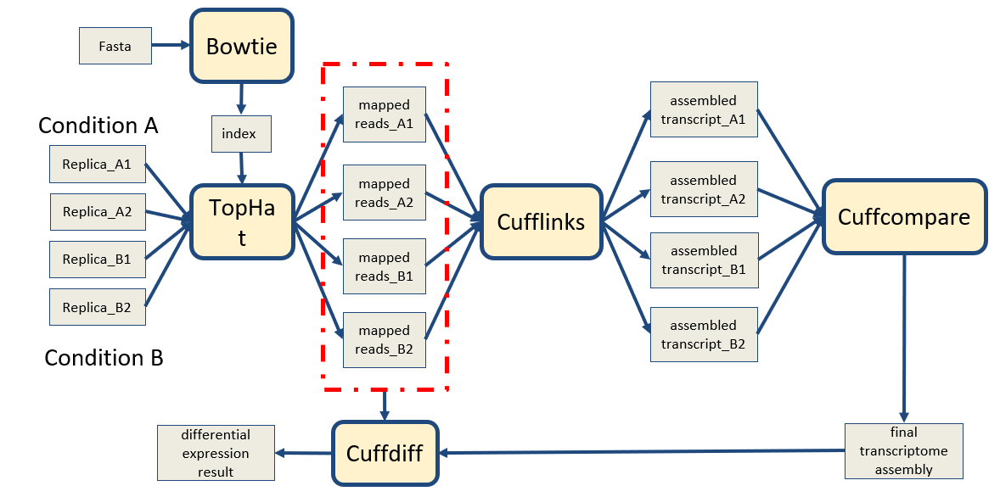

This folder contains details to enable RNASeq workflow on private machines using docker. Below are the steps to be followed to host the docker container.

# RNASeq-Workflow
Below figure shows the pipeline of the workflow:

RNA-Seq analysis workflow is used to perform quantification of gene expression from RNA-Seq transcriptomics data and statistical analysis to discover differential expressed genes/isoform between various experimental groups conditions. The paired-end or single-end reads are aligned to the reference genome via Tophat2. The mapped reads are summarized and aggregated over genes and isoforms for a particular organism’s gene and genome version to then calculate the gene expression FPKMs values via Cufflinks. Then, the transcriptome assembly generated from Cufflinks will be processed via Cuffcompare to perform these comparisons and assess the quality of assembly. Finally, genes and isoforms expressed differentially between the various pair wise comparisons within experimental groups/conditions are identified using Cuffdiff.

# Docker Container
The docker container is availbale on DockerHub and can be downloaded and initialized by below steps,

docker pull apfd6/rnaseq_wf
docker run apfd6/rnaseq_wf
docker exec --user bamboo -it <ContainerId> bash

## Configuring the container

### Create User Credentials:

$ mkdir -p ~/.ssh  
$ ssh-keygen -t rsa -b 2048 -f ~/.ssh/workflow  
  (just hit enter when asked for a passphrase)  
$ cat ~/.ssh/workflow.pub >>~/.ssh/authorized_keys

### Initialize HTCondor

cd condor-8.8.9
. ./condor.sh
condor_master

### Initialize workflow configuration file
Open .rnaseq-workflow.conf file and make below changes
[cyverse]
username = <your cyverse user name>

### Initialize Cyverse connection file

To access data from the iPlant iRods repository, you need a file in your home directory. The name and format of this file depends on if you are using a system with iRods version 3 or version 4. For version 3, you need a file named ~/irods.iplant.json, with 0600 permission and content as below:

{
    "irods_host": "data.iplantcollaborative.org",
    "irods_port": 1247,
    "irods_user_name": "YOUR_IRODS_USERNAME",
    "irods_zone_name": "iplant",
    "irodspassword": "YOUR_IRODS_PASSWORD"
}

$ chmod 0600 irods.iplant.json

### Initialize Workflow
cd rnaseq
./workflow-generator --exec-env distributed

This will start the workflow.
