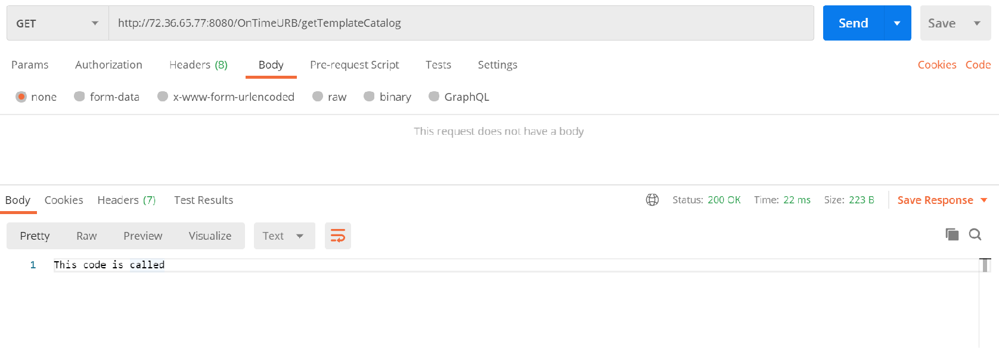
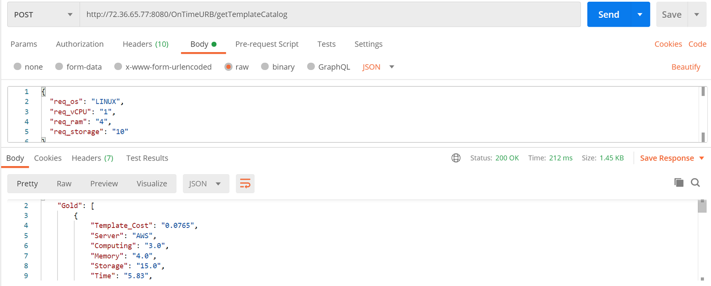

# OnTimeURB Docker Container

The docker container is availbale on DockerHub and can be downloaded and initialized by below steps,
```
docker pull apfd6/ontimeurb:V1
docker run -it apfd6/ontimeurb:V1 bash

```
## Configuring and tuning the OnTimeURB optimizer engine
The optimizer engine can be configured as per researcher using config.properties file. Below are the governing variables.
```
a) Inputing possible supported operating system, it is used to validate knowledge base format \
os = LINUX,RHEL,SLES,WINDOWS 

b) knowledge base platforms available and to be considered for brokering \
csp_files = AWS,GENI,GCP,AZURE

c) Default configuration of user input for optimizer engine if explicit requirements not provided\
req_os = LINUX \
req_vCPU = 1 \
req_ram = 2 \
req_network = 5 \
req_clock = 2 \
req_gpu = false \
req_storage = 10 \
req_ssd = false \
req_threshold = 20 \
req_preference = NA 

d) is agility considered while brokering\
agility_enabled = false 

e) default agility factor values for CSPS: AWS, GENI, GCP, AZURE as per user perception\
ag_factor_aws = 10.0 \
ag_factor_geni = 4.0 \
ag_factor_gcp = 9.6 \
ag_factor_azure = 8 

f) is machine learning enabled while brokering and if default bias towards platforms has to be considered\
ml_enabled = false \
ml_default = true 

g) default probability distribution towards platforms when ml is enabled \
prob_factor_aws = 0.4 \
prob_factor_geni = 0.1 \
prob_factor_gcp = 0.2 \
prob_factor_azure = 0.3 


h) maximum price of any single instance from any cloud platform, this is used for nirmalization of prices. \
max_instance_price = 5.424 

```


## Starting OnTimeURB

```
docker ps

# This will fetch the container id
docker exec --user root -it <container_isd> bash

#Move to base home folder
cd

#Move to apache and start the ontimeurb service
cd apache/bin
./startup.sh

#exit the container console
Ctrl + p + q

# Attach docker port to host port for the image
docker run -it -d -p 8080:8080 apfd6/ontimeurb:V1 bash

#get ip address for container
docker inspect <container_id>

# The we service will initiate at
http://<ip_address>:8080/OnTimeURB/getTemplateCatalog

```
## OnTimeURB Web Services
```

GET & POST services 
http://<ip_address>:8080/OnTimeURB/getTemplateCatalog
http://<ip_address>:8080/OnTimeURB/getRecommendation

```





