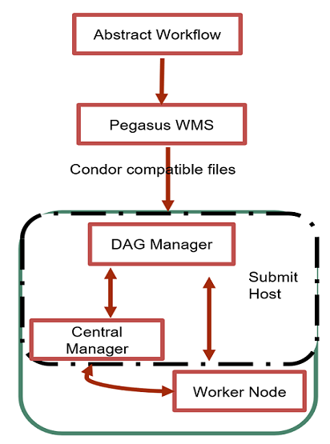

# Table of Contents
- [OnTimeURB](https://github.com/AshishPandey90/OnTimeURB/blob/master/README.md#purpose-of-project--intended-software-users--audience)  
+ [OnTimeURB](https://github.com/AshishPandey90/OnTimeURB/blob/master/README.md#purpose-of-project--intended-software-users--audience)
 

# Purpose of project >> Intended Software Users / Audience
 a) exactly what can be done with the softwares...orientaton/marketing material.
 b) Advantages, visual and graphics for config, configuration interface, content should be enough for webinar. Check CIPRES.  check with songjie.., put some marketing text showing variations in software usability. 
 b.1) Test tutorial, buy credit??, reduced dependency
 c) security concerns
 d) spectrum of users from >> small scale lab (sys admins etc) to large scale CI enginers, multiple clouds, large clusters >> optimize which resource to use when all machines consdiered.
 
 
 This software enables researchers in better utilizing compute resources available with them at local servers as well resources allocations on public clou platforms. It gives reserachers flexibiltiy in creating hybrid cyber infrastruture for their applications requirements. The software have the capapbility of deducing real time the ideal compute  resources for application execution and stages the tasks on those respurces.  
 
 We provide docker containers for enabling standalone web services of OnTimeURB with accessible user interface to help in resource brokering as per researchers requirement. We also provide a sample integration of OnTimeURb with bioinformatics workflows to show its effectivity throught docker containers. Docker containers for below workflows are available at OnTimeURB/Docker_Containers/Bioinformatics_Workflows/ with instructions to use them

Bioinformatics Workflows. 

a) Alignment workflow

b) CNV workflow

c) FastQC workflow

d) Methylation workflow

e) RNASeq workflow

f) PGen workflow. 
 
 
 
# OnTimeURB
OnTimeURB Optimizer Project
OnTimeURB stands for on time universal broker.
This framework is created for configuring cloud infrastructure for scientfic/bioinformatics workflows. There are three components to this infrastructure deployment.

a) Configuring the infratructure with tools which help in distributed computing.

b) Optimizer engine which helps in resource and service brokering for the users.

c) Machine learning model to learn about performance variation incurred with execution of workflows on the infrastructure.

d) Workflows are not included in this repository, but can be referered at Pgen workflow:https://github.com/pegasus-isi/PGen-GenomicVariations-Workflow

## Configuring the infrastructure
To create an infrastructure for distributed computing essentially a single submit server(host) and many client servers(clients) architecture is required. Towards that architecture varying configurations has to be made in submit host and clients. Below tools are used for ceating the infrastructure,

a) A linux host machine with good resource configuration to host the cluster of clients interaction. A machine with 2-4 CPU cores, 8-16 GB RAM, 500 GB storage can be recommended, but it is subjective to user.

b) *Pegasus Workflow Management System*

c) *HTCondor high throughput computing*

d) *pyglidein* (python server-client pair for submitting HTCondor glidein jobs on remote batch systems)

Steps to be followed for configuration,
### On Submit Host Server

a)	Install HTCondor personal edition
  --Download HTCondor 8.8.4 from: https://research.cs.wisc.edu/htcondor/downloads/
  --Install following the page https://research.cs.wisc.edu/htcondor/instructions/ubuntu/18/stable/
Need to run this command before beginning: (sudo chmod 777 /etc/apt/sources.list)

b)	Install Pegasus
  --Install without root access or follow the strategy above for HTCondor
    https://pegasus.isi.edu/downloads/
    
c)	Install PyGlidein
      https://pegasus.isi.edu/documentation/pyglidein.php
    To setup password for HTCondor, follow this page:
      https://research.cs.wisc.edu/htcondor/manual/v7.8/3_6Security.html
    specifically, the command to generate a password file is:
      condor_store_cred -f file (or with path to file)
      
d)	Configure condor_config file in the /condor/etc/ folder to the working template, included is the command to configure the port to be static so we do not have to change it every time we restart the server. Then use the command “        ” to open up the port.

e)	Configure sites.xml file in the workflow work dir using the working template with the scp commanded added and local storage/scratch folder paths. (This step is to configure workflows to be executed on distributed nodes)

f) Start a new job, wait for it to become Idle(Idle jobs arepicked by the client nodes for execution), then start the server.

g) After starting the client, check condor_q and condor_status to check for the attached Lewis computing nodes, we can see a new computing node will be added and stays busy for a while

h) When the job status goes to done, check the output folder for job results. 

### On Client Server

a) Install PyGlidein following the website: https://pegasus.isi.edu/documentation/pyglidein.php

b) If there is no job scheduler on the client, we need to install HTCondor by compiling the tarball (this could be very difficult and easily fail)
    If you have a scheduler already installed on the client node, then there is no need to generate a new tarball on the client, just       download the example one from the website, untar it, replace the password file by downloading/uploading the password file generated     on the server (Step 1), then chmod the password file to 400, and make the tarball again

c) On Lewis account, create and configure a lewis.config file to configure the running environment and connection to the submit host

d) On Lewis node, create the two folders specified in the server config file (condor_config) to hold temp data

e) Create a new folder (e.g. glidein) for holding glidein and log files on the node, it looks like the default scratch on Lewis is not     compatible with glidein (according to Mats)

f) Modify the glidein_start.sh script to use the collector port that we created on the server (lines 86-87), then comment out lines         180-220 and 233-234.

g) After starting the server on the submit host, start the client to accept the job:
      $ pyglidein_client --config=lewis.config --secrets=secrets

h) Go to glidein folder and then the job folder, check for log files especially the MasterLog

i) Go to the out folder and check for job logs

## Optimizer Engine

The optimizer engine is based on integer linear programming for selection of cloud node instances to compose cloud template solution.
The engine is based on a knowledge base of instances from multiple cloud service providers in particular Amazon Web Services, GENI, Microsoft Azure, Google Cloud Platforms. The repository has the sample knowledge base files as AWS.json, AZURE.json, GCP.json, GENI.json
Furthermore instance from the cloud platform providers can be added as json object to the files following the below format,

{
  "csp":"GENI",  <*cloud platform name*> \
  "OS":"LINUX",  <*type of operating system on the instance*> \
  "name":"instageni.umkc_1", <*name of the instance*> \
  "vCPU":"1",    <*number of CPU cores*> \
  "ram":"1.5",   <*amount of RAM*> \
  "price":"0.0195", <*price of the instance per hour*> \
  "network":"5",    <*claimed network bandwidth*> \
  "clock":"1.2",    <*cock speed of processor in GHz*> \
  "pricing_ssd":"0.10",  <*price of SSD storage with the cloud platform*> \
  "pricing_hdd":"0.045"  <*price of HDD storage with the cloud platform*> 
}

The optimizer engine source is attached with the repository, the optimizer engine has certain prerequisites in terms of softwares. Below are the prerequisites,
a) Install latest JDK: https://www.javahelps.com/2019/04/install-latest-oracle-jdk-on-linux.html 

b) Install latest Apache Tomcat Web Server: https://tomcat.apache.org/tomcat-9.0-doc/setup.html

c) Install *ILOG CPLEX* (student or trial version can be downloaded), https://www.ibm.com/analytics/cplex-optimizer This is required as    it is used within the optimizer for integer linear programming.

d) The signature of the web service to be called with the optimizer:
   http://locahost:8080/TestingWeb/rest/getTemplateCatalog
   OR
   http://<machine_IP>:<machine_Port>/TestingWeb/rest/getTemplateCatalog
   
e) The repository have attached file with the name "Optimizer_Web_Service_Input" & "Optimizer_Web_Service_Output" for expected input and    output to the optimizer web service.

## Configuring and tuning the OnTimeURB optimizer engine
The optimizer engine can be configured as per researcher using config.properties file. Below are the governing variables.

a) Inputing possible supported operating system, it is used to validate knowledge base format \
os = LINUX,RHEL,SLES,WINDOWS 

b) knowledge base platforms available and to be considered for brokering \
csp_files = AWS,GENI,GCP,AZURE

c) Default configuration of user input for optimizer engine if explicit requirements not provided\
req_os = LINUX \
req_vCPU = 1 \
req_ram = 2 \
req_network = 5 \
req_clock = 2 \
req_gpu = false \
req_storage = 10 \
req_ssd = false \
req_threshold = 20 \
req_preference = NA 

d) is agility considered while brokering\
agility_enabled = false 

e) default agility factor values for CSPS: AWS, GENI, GCP, AZURE as per user perception\
ag_factor_aws = 10.0 \
ag_factor_geni = 4.0 \
ag_factor_gcp = 9.6 \
ag_factor_azure = 8 

f) is machine learning enabled while brokering and if default bias towards platforms has to be considered\
ml_enabled = false \
ml_default = true 

g) default probability distribution towards platforms when ml is enabled \
prob_factor_aws = 0.4 \
prob_factor_geni = 0.1 \
prob_factor_gcp = 0.2 \
prob_factor_azure = 0.3 

h) maximum price of any single instance from any cloud platform, this is used for nirmalization of prices. \
max_instance_price = 5.424 

## Machine Learning Model

The model is introduced as an aid to the optimizer engine to learn from previous application workflow executions and is implemented in java language. The prime objective of the model is to predict favorable cloud service platform (CSP) for executing certain application. The model tries to learn this from previous executions of the workflows and taking feedback from expert users for the corresponding cloud resource allocations. Since different users can have different priorities of CSPs for similar application workflows, this kind of learning should be classified based on probability, specifcally *naive bayes method* is implemented for classification. The probabilistic classification of selection of cloud platform can be used to bias the optimizer towards selecting specific platforms.

## Bioinformatics Workflows

Please refer to https://github.com/tang27abu/Pegasus-Workflow

